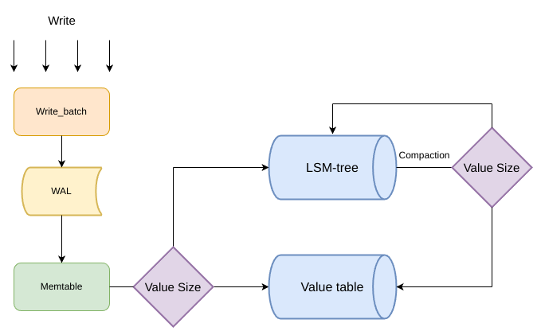

## Tskydb

Tskydb 是一个基于 LSM-tree 的 key-value 存储引擎，其设计灵感来源于一篇解决 LSM-tree 写放大的 key-value 分离论文《WiscKey》

### Tskydb 架构



### 设计

- 批量处理写入请求:

  通过使用 Write_batch 缓存写入请求，以批量方式写入 WAL，从而减少磁盘 I/O 操作并提升写入效率。

- WAL:

  参考 LevelDB 的 WAL 设计，将日志文件分割成多个 32KB 大小的连续 Block，优化读取性能。

- key-value 分离：

  Tskydb 的实现中，并没有实现论文所提到的 vLog，因为 vlog 是无序的，考虑到实现成本，设计出一个有序的表结构，这允许重用现有的 Compaction 逻辑，避免了单独开发 GC 模块的需要，所以根据 value 的大小(默认是 4096 byte)，将小 value 直接以 [key,value] 的形式存储在 LSM-tree 中，而将大 value 存储在单独的 Value table 中,并在 LSM-tree 中存储指向这些 values 的偏移量。

- 冷热分离：

  为了降低读放大，将 SSTable 进行冷热分离，使用 LRU-K 算法以追踪每个数据项的最近 K 次访问记录，从而优先缓存热点数据。

- MVCC：

  通过一个双向链表的 VersionSet 来管理数据不同的版本，利用全局递增的 SequenceNumber 来确定不同版本 key 的有效性和释放时机。使用引用计数机制来控制文件的生命周期。

- Compaction：

  参考 leveldb，实现了 Minor Compaction 与 Major Compaction。

### 优化
Tskydb 目前仍然处于开发阶段。

还有很多值得再优化的内容：

- 故障恢复\
  目前 Tskydb 仅有的 WAL 功能并不足以处理所有的故障恢复问题，例如当数据库且当时正在写 Manifest 文件或 SSTable ，可能导致这些文件的损坏。或许可以参考 leveldb ，其做法是对外提供 Repairer，让用户尝试手动修复。

- 垃圾回收\
  对于每一个 Vtable 在内存中记录其可丢弃的数据大小，当该大小超过一定的阈值时，直接进行 Compaction。

- 并行范围查询\
  由于并行范围查询，key value 可能单独存在与不同的表中，此时范围查询则需要随机读取，WiscKey 利用 SSD 设备的并行 I/O 特性在范围查询期间从vLog 中预取值，根据其思想，或者可以在 Vtable 中牺牲一些存储空间以保持数据的有序性，通过预读的方式，预先读取一段数据块而非单个键值来提升并行范围查询的性能。

### 构建

```
make build && cd build
cmake ..
make
```